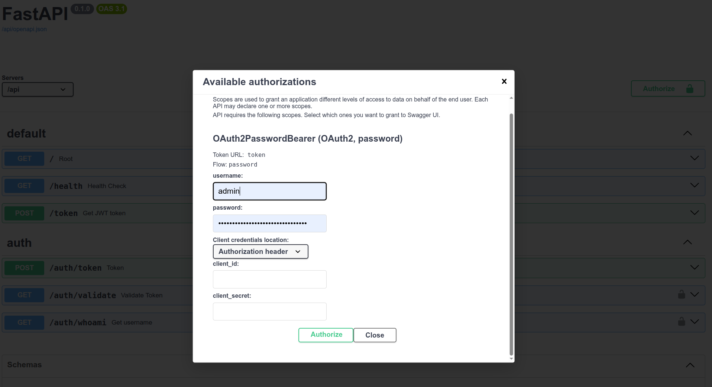
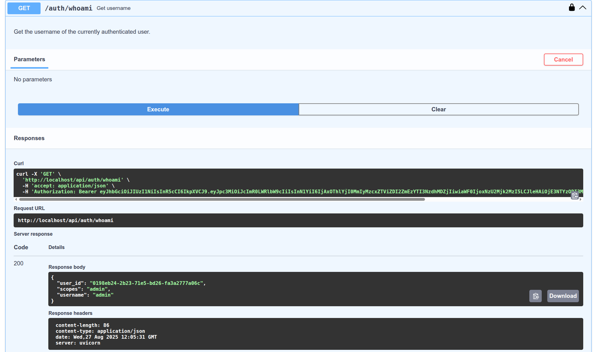

# Root FastAPI server for the DT demo

This Python package contains the root FastAPI server for the DT demo.  The following endpoints are provided:

- `/` Hello World
- `/health` Healthcheck (for Docker or K8s)
- `/token` redirect to `/auth/token` (assumes it exists)

All other functionality is provided by mounting additional routers.  These can be imported from the current Python package, the `uv` workspace, or any package that can be installed via `uv add` (see: [Dependency Sources](https://docs.astral.sh/uv/concepts/projects/dependencies/#dependency-sources)).

The currently mounted routers are:
- `dt-demo-auth`: Provides authentication services.

## Traefik reverse proxy

Our Traefik setup mounts our API at `/api`; thus, our container entrypoint is `fastapi run --root-path /api ...`.  Add `/api` to all URL paths shown in this README.  Note that we use the [StripPrefix](https://doc.traefik.io/traefik/reference/routing-configuration/http/middlewares/stripprefix/) middleware for our FastAPI router.

## Swagger UI

Automatically generated Swagger documentatation is available at `/docs`.  To access restricted endpoints, use the `Authorize` button in the top right corner of the interface:

Example of Swagger UI interaction:

## Multiple API servers

Note it is possible to deploy a second API server, as long as the frontend is set up to use both servers.  However, only one server will be responsible for authentication.  The other server will still need a copy of the JWT secret to validate requests, but does not issue new JWTs itself.
