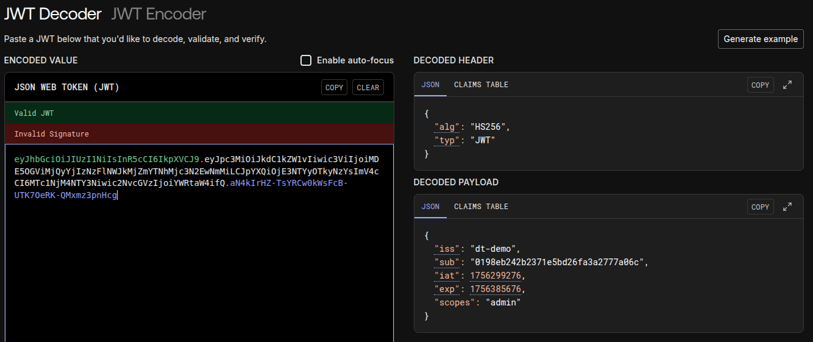

# Authentication API router

This Python package provides the `/api/auth` routes for the DT demo.

## JWT format

The JWT claims table looks like this:

```json
{
  "iss": "dt-demo",
  "sub": "0198eb242b2371e5bd26fa3a2777a06c",
  "iat": 1756299276,
  "exp": 1756385676,
  "scopes": "admin"
}
```

when encoded and signed with the JWT secret, the result looks like this (Decoding provided by [jwt.io](https://jwt.io)):


The fields of the claims table are as follows:

- `iss`: the JWT issuer. Here, we just use our project name.
- `sub`: the JWT subject, or who the JWT applies to.  We use an UUID to identify users.
- `iat`: issued at, a UNIX timestamp.
- `exp`: expiry timestamp.
- `scopes`: a list of scopes granted to the user; services in the DT platform can limit access based on scope.
    Example: `app1,app2:admin`.
    - The admin scope grants admin access to the DT platform as a whole (add/remove users, add/remove grants)

## Login process

1. The client uses the frontend app to send a request to `/api/auth/token`.
2. The API server sends a JWT to the client.
3. The frontend stores a cookie containing the JWT.
4. All subsequent API requests made by the frontend **must** attach the stored JWT in its HTTP headers.

An example API request containing the JWT:
```bash
curl -X 'GET' \
  'http://localhost/api/auth/whoami' \
  -H 'accept: application/json' \
  -H 'Authorization: Bearer eyJhbGciOiJIUzI...'
```

> [!NOTE]
> Since passwords are sent to the API server in plaintext, it is important to use TLS.  For development purposes, we can use Ngrok to provide a public tunnel to our DT platform with [automatic TLS termination](https://ngrok.com/docs/universal-gateway/tls-termination/)).

## Further reading

See RFC [6749](https://datatracker.ietf.org/doc/html/rfc6749#section-4.1.1) and [6750](https://datatracker.ietf.org/doc/html/rfc6750#autoid-6).
